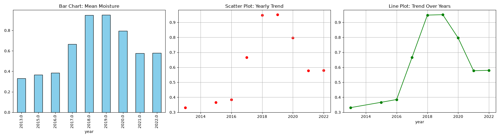

# AGE 219 capstone project : soil moisture analysis for agricultural sustaibability
### Author Details
**Student Name** LEITURA MURAKE COSMAS
**Registration Number** AGE/D/2024/0023
**Instructor Name** Dr kadeghe Fue
## project visualizations

## Problem Statement
The primary challenge addressed in this project is the inefficient management of soil moisture. Due to climate change, many farmers struggle with a lack of precise knowledge regarding the water requirements of their crops, which leads to reduced productivity, water wastage, and crop failure. This project aims to analyze datasets to provide a better framework for moisture management to improve agricultural efficiency.

## Data Source
The data used in this analysis was mined from the World Bank Data repository. I utilized more than 10 files containing various statistics on climate, water usage, and soil moisture levels across different regions to obtain a comprehensive and accurate analysis.

## Methodology
In the data processing phase, I utilized the following libraries:
* Pandas: I used Pandas for cleaning, merging all 10+ files, and performing initial statistical analysis to understand soil moisture trends.
* SciPy: I used SciPy to conduct scientific and statistical analysis to evaluate the relationship between climate change and moisture levels, and to implement accurate statistical models.

## Results & Conclusion
The analysis reveals a significant correlation between optimal water management and crop yield. In conclusion, the use of digital tools to analyze moisture data is a crucial step toward achieving sustainable agriculture and mitigating the effects of drought.